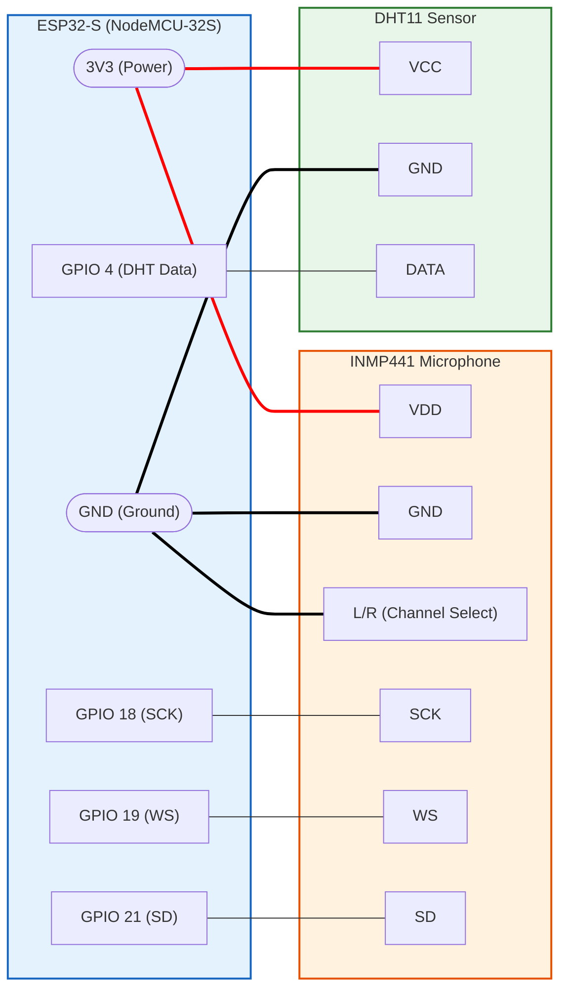

# ESP32 Audio & Weather Monitor

This project successfully integrates an **INMP441 I2S Microphone** and a **DHT11 Temperature/Humidity Sensor** using an ESP32-S (NodeMCU). 

https://github.com/user-attachments/assets/db256745-30d1-4de7-838c-bce71d615b78

## ⚠️ Hardware Warning
* **Do not use ESP32 DevKit V1 (Rev 1 chips)**: They have a known APLL clock bug that prevents the INMP441 from syncing properly. Use an ESP32-S or NodeMCU (Rev 3).
* **Power**: Power the sensors directly from the `3V3` pin, not via GPIOs.

## 🔌 Pinout Configuration

| Component | Sensor Pin | ESP32 Pin | Function / Note |
| :--- | :--- | :--- | :--- |
| **INMP441** | **SCK** | **GPIO 18** | I2S Serial Clock |
| | **WS** | **GPIO 19** | I2S Word Select |
| | **SD** | **GPIO 21** | I2S Serial Data |
| | **L/R** | **GND** | Selects Left Channel (Crucial) |
| | **VDD** | **3V3** | Main Power |
| | **GND** | **GND** | Ground |
| | | | |
| **DHT11** | **DATA** | **GPIO 4** | Temp/Humidity Data |
| | **VCC** | **3V3** | Main Power |
| | **GND** | **GND** | Ground |

## 📐 Circuit Diagram

### Did the hardware part
### Integration and Software was done by sidoit(Sidhart Sajith)
